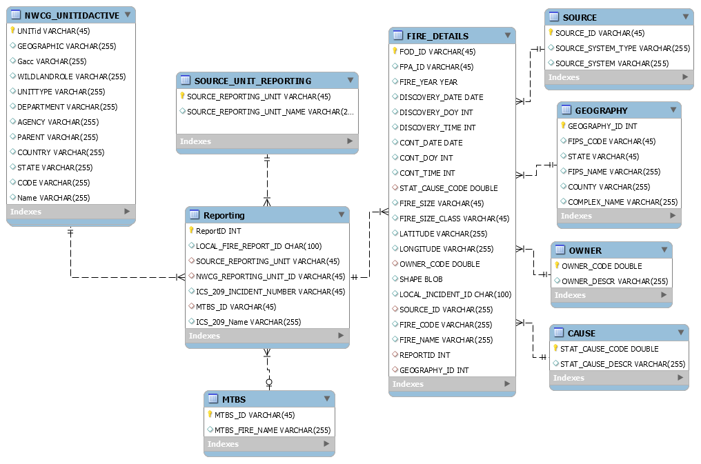

# Data-Modeling

This contains database modeling project, where we were given US fire database with 1.88 million records.

We were asked to normalize the data and feed that data in normalized tables.
We had to share our insights using those normalized tables using SQL.

We divided data in nine tables.

Below is the representation of the E-R diagram we created.

